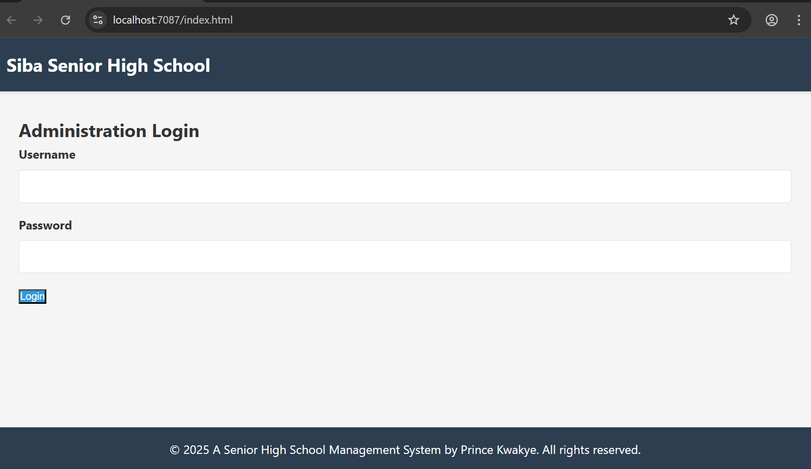

# School Management System

A web application for managing student registration, course assignments, and timetables for a Senior High School.

---

## Features

- **Secure Login** – Authentication for school administration staff  
- **Student Registration** – Create and manage student profiles  
- **Course Management** – Create courses and assign them to students  
- **Timetable Creation** – Generate timetables for students  
- **Timetable Viewing & Printing** – View and print student timetables  

---

## Tech Stack

- **Backend**: .NET Core Web API  
- **Frontend**: Javascript, HTML5, CSS3  
- **Database**: PostgreSQL  

---

## Prerequisites

- .NET SDK >= 6.0   
- PostgreSQL >= 12  

---

## Getting Started

### 1. Clone the Repository

```bash
git clone https://github.com/Prince-Kwakye/SibaSchoolManagementApi.git
cd SibaSchoolManagementApi
```

---

## Usage

- Log in as administrator  
- Register or manage students  
- Create and assign courses  
- Generate student timetables  
- View or print timetables  

---

## Screenshots

### Login Page


### Dashboard


### Timetable


### Student


### Timetable


---

## Contributing

Pull requests and issues are welcome.

---

## License

MIT © 2025 Prince Kwakye
